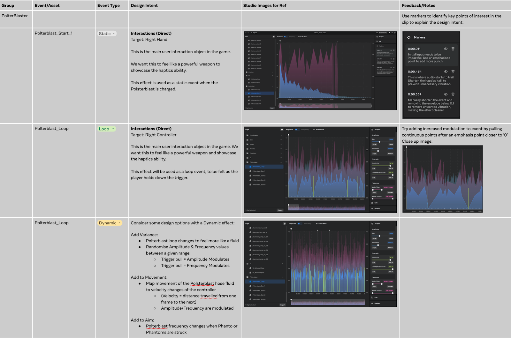
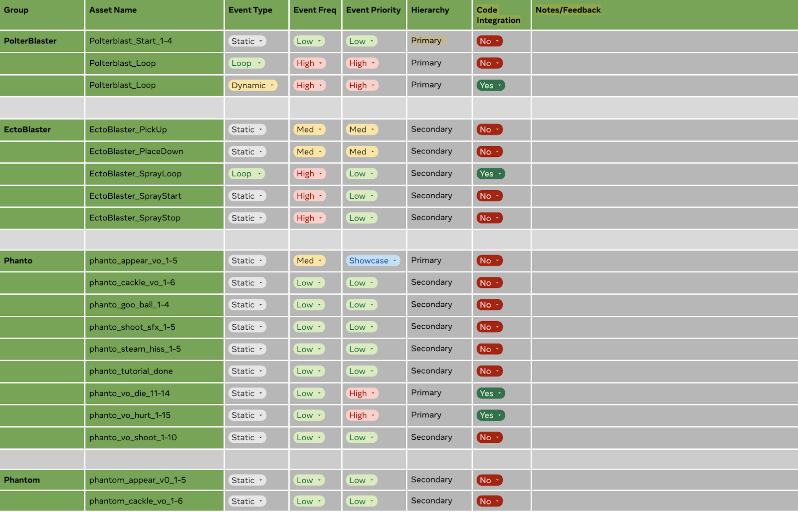

# Haptics Studio Examples


The Haptics Studio Examples repository contains sample projects for Meta Haptics Studio and example projects based on Meta’s haptic design guidelines.

Meta Haptic Design Guidelines: https://developer.oculus.com/resources/haptics-design-guidelines


## Licenses

All files in this repository are released under the Oculus SDK License Agreement. The MIT licence applies to the files and assets in the Assets/Project folder. Otherwise, if an individual file does not indicate which license it is subject to, then the Oculus License applies.


## Getting started

First, ensure you have Git LFS installed by running this command:


```console
git lfs install
```


Then, clone this repo using the "Code" button above, or this command:


```console
git clone https://github.com/oculus-samples/haptics-studio-examples.git
```


Haptics Studio Projects each consist of a .hasp file for Meta Haptics Studio, and its corresponding audio files. To open a project, download the latest version of Meta Haptics Studio and open the .hasp file contained in the pack.

Haptics Project Examples contains examples for structuring your design work, preparing a seamless integration process by defining playback priorities, and providing a framework for collecting feedback about haptics in your project.

Learn more about the design process at https://developer.oculus.com/resources/haptics-design-guidelines

Below is an example project plan from an open source MR project called Phanto.


## Phanto Haptics Project Plan

[Phanto](https://github.com/oculus-samples/Unity-Phanto) is an open-source Mixed Reality template to highlight the capabilities of the Quest 3 and available Unity SDKs. Project Phanto is an open-source Unity reference app, showcasing the latest Presence Platform features, highlighting scene mesh, Scene Model, and Scene API objects

The haptic assets used in this project have been designed with Haptics Studio, and were integrated using the Haptics SDK for Unity.


The game adheres to the  Meta Mixed Reality H&S Guidelines.

Gameplay:
Phanto is an Arcade-Style FPS shooter in which the player must defeat the spawning Phantoms squirting Ectofluid all over the shop. The player is armed with a Polterblast (Anti-Ectofluid gun) and an Ectoblaster (a remote Turret Gun placed on the floor).


_Polterblast 3000 - Blast that Ectoplasm: right hand control_


_Ectoblaster - Turret blasting phantoms: left hand control_

Once Phanto and the Phantoms have been defeated the player wins!
If your room is covered in Ectofluid - you lose!

Enemies:
* **Phanto** is the boss Phantom that flies around the room spurting Ectofluid onto every surface.
* The **Phantoms** are smaller enemies that spawn across your table, sofa, ceiling and eject vast quantities of Ectofluid onto your lovely clean rug.

_Phanto and the Phantoms - Coming to get you_


In order to structure design work, we organize assets into four categories:
Interactions (Direct) - Game objects and interactions. (doors, weapons, items, lock picking etc.)
* Interactions (In-Direct) - Haptics for gestures and guidance (latching, aiming, puzzles etc.)
* Cinematic Immersion - Cut Scenes, character signatures, immersion without direct interaction
* Music - Haptics that match music scores for dramatic immersion or added suspense (also character signatures)

Designate the Event Types:

* **Static**: A standard one shot event that is triggered by a controller interaction or game event.
* **Loop**: Haptics play in a loop - i.e. while holding a trigger.
* **Dynamic**: Dynamic events typically follow controller or user interactions, for example pulling a virtual bow string with the controller might increase amplitude and frequency





## Event Priority / Hierarchy Example Template:
Event Frequency:

* **Showcase**: A particular point of interest to be highlighted i.e. Boss fight, Cinematics, Special ability
* **High**: An event that happens regularly i.e. Run/Jump/Shoot
* **Med**: An event that happens often e.g. Reloading/Item retrieval
* **Low**: An event that happens infrequently e.g. Acquiring health or a special ability/Upgrades, UI/UX

Hierarchy - The order in which these events will be implemented into the game engine. This can dictate which events have priority over others when being called/triggered. E.g. Adding health or taking damage will have a Low event Frequency but will have a higher priority order than a High frequency looped gunshot.


